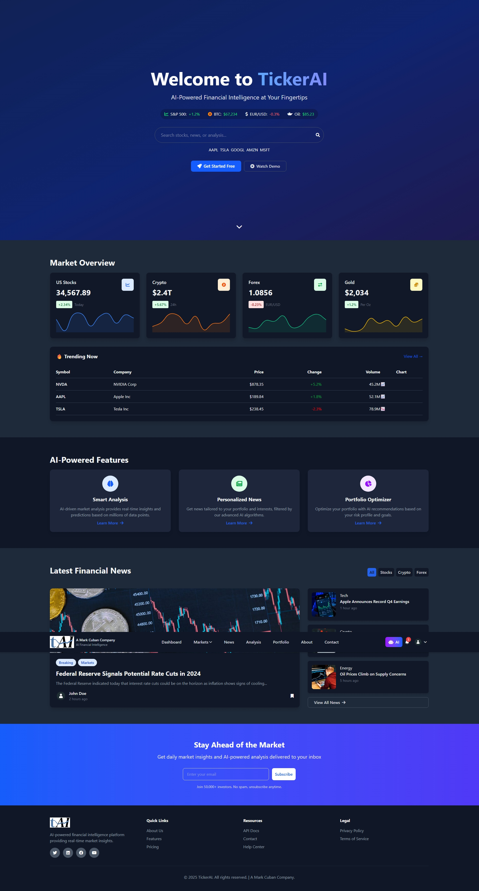

# 📈 TickerAI - AI-Powered Financial Market News Aggregator

<div align="center">
  
  
  [](https://opensource.org/licenses/MIT)
  [](https://github.com/EyachirArafat/TailwindCSS_Project_2)
  [](https://github.com/EyachirArafat/TailwindCSS_Project_2/pulls)
  [](https://github.com/EyachirArafat/TailwindCSS_Project_2/graphs/commit-activity)
  
  <p align="center">
    <strong>A Mark Cuban Company</strong><br>
    Real-time financial news aggregator powered by AI for smarter investment decisions
  </p>

  [Live Demo](https://tickerai-iota.vercel.app/) • [Documentation](https://tickerai-iota.vercel.app/) • [Report Bug](https://github.com/EyachirArafat/ticker_AI_project/issues) • [Request Feature](https://github.com/EyachirArafat/ticker_AI_project/issues)
</div>

---

## 🌟 Overview

TickerAI is a cutting-edge financial news aggregation platform that leverages artificial intelligence to deliver personalized, real-time market insights. Built with modern web technologies, it provides investors and traders with the tools they need to make informed decisions in today's fast-paced financial markets.

## ✨ Features

### 📊 **Market Intelligence**
- **Real-time Market Data** - Live updates from global financial markets
- **AI-Powered Analysis** - Smart insights and predictions using machine learning
- **Personalized News Feed** - Customized content based on your investment interests
- **Advanced Charting** - Interactive charts with technical indicators

### 💼 **Portfolio Management**
- **Portfolio Tracking** - Monitor your investments in real-time
- **Performance Analytics** - Detailed analysis of your portfolio performance
- **Risk Assessment** - AI-driven risk analysis and recommendations
- **Watchlist Management** - Track stocks, crypto, forex, and commodities

### 🔔 **Smart Alerts**
- **Price Alerts** - Get notified when assets hit target prices
- **News Alerts** - Breaking news for your watchlist items
- **Market Movement Alerts** - Significant market changes notifications
- **Custom Alert Rules** - Create personalized alert conditions

### 🤖 **AI Features**
- **AI Chat Assistant** - Get instant answers to financial questions
- **Sentiment Analysis** - Market sentiment tracking from news and social media
- **Predictive Analytics** - AI-based price predictions and trends
- **Smart Recommendations** - Personalized investment suggestions

### 👤 **User Experience**
- **Dark/Light Mode** - Comfortable viewing in any environment
- **Responsive Design** - Seamless experience across all devices
- **Multi-language Support** - Available in multiple languages
- **Offline Mode** - Access cached data without internet

## 🛠️ Tech Stack

### **Frontend**
- **HTML5** - Semantic markup structure
- **Tailwind CSS v4** - Utility-first CSS framework
- **JavaScript (ES6+)** - Modern JavaScript features
- **Alpine.js** - Lightweight reactive framework
- **Chart.js** - Interactive data visualization

### **Backend Integration**
- **RESTful API** - Standard API architecture
- **WebSocket** - Real-time data streaming
- **OAuth 2.0** - Secure authentication
- **JWT** - Token-based authorization

### **Tools & Libraries**
- **Vite** - Next-generation frontend tooling
- **Axios** - HTTP client for API requests
- **Socket.io** - Real-time bidirectional communication
- **Date-fns** - Modern date utility library
- **Lodash** - Utility functions library

## 🚀 Quick Start

### Prerequisites

- Node.js 16.0 or higher
- npm or yarn package manager
- Git

### Installation

1. **Clone the repository**
```bash
git clone https://github.com/EyachirArafat/ticker_AI_project.git
cd ticker_AI_project
```

2. **Install dependencies**
```bash
npm install
# or
yarn install
```

3. **Set up environment variables**
```bash
cp .env.example .env
```

Edit `.env` file with your configuration:
```env
VITE_API_BASE_URL=http://localhost:5000/api
VITE_API_KEY=your_api_key_here
VITE_WS_URL=wss://stream.tickerai.com
VITE_GOOGLE_CLIENT_ID=your_google_client_id
```

4. **Run development server**
```bash
npm run dev
# or
yarn dev
```

5. **Build for production**
```bash
npm run build
# or
yarn build
```

6. **Preview production build**
```bash
npm run preview
# or
yarn preview
```

## 📁 Project Structure

```
ticker-ai/
├── .vscode/
├── components/
├── css/
│   └── tailwind.css
├── data/
├── js/
│   ├── analysis.js
│   ├── api.js
│   ├── auth.js
│   ├── components.js
│   ├── contact.js
│   ├── dashboard.js
│   ├── main.js
│   ├── news.js
│   ├── portfolio.js
│   ├── register.js
│   └── settings.js
├── node_modules/
├── pages/
│   ├── about.html
│   ├── analysis.html
│   ├── contact.html
│   ├── dashboard.html
│   ├── login.html
│   ├── news.html
│   ├── portfolio.html
│   ├── register.html
│   └── settings.html
├── public/
│   └── assets/
│       ├── fonts/
│       ├── icons/
│       └── images/
├── .env.example
├── .gitignore
├── 404.html
├── bun.lock
├── index.html
├── package.json
├── README.md
├── vercel.json
└── vite.config.js
```

## 📱 Screenshots

<div align="center">
  <h3>🏠 Homepage</h3>
  
  
  <h3>📊 Dashboard</h3>
  
  
  <h3>📰 News Feed</h3>
  
  
  <h3>💼 Portfolio</h3>
  
</div>

## 🔧 Configuration

### Tailwind CSS Configuration

The project uses Tailwind CSS v4 with custom configuration:

```javascript
// tailwind.config.js
module.exports = {
  content: ["./index.html", "./pages/**/*.html", "./js/**/*.js"],
  darkMode: 'class',
  theme: {
    extend: {
      colors: {
        primary: { /* custom colors */ },
        dark: { /* dark mode colors */ }
      }
    }
  }
}
```

### API Configuration

Configure API endpoints in `js/api.js`:

```javascript
const API_CONFIG = {
  baseURL: process.env.VITE_API_BASE_URL,
  timeout: 10000,
  headers: {
    'Content-Type': 'application/json'
  }
}
```

## 📚 API Documentation

### Authentication

```javascript
// Login
POST /api/auth/login
{
  "email": "user@example.com",
  "password": "password123"
}

// Register
POST /api/auth/register
{
  "name": "John Doe",
  "email": "user@example.com",
  "password": "password123"
}
```

### Market Data

```javascript
// Get market overview
GET /api/market/overview

// Get stock quote
GET /api/stocks/{symbol}/quote

// Get trending stocks
GET /api/stocks/trending
```

### News

```javascript
// Get latest news
GET /api/news/latest?category=all&limit=10

// Search news
GET /api/news/search?q=bitcoin
```

## 🤝 Contributing

We welcome contributions! Please follow these steps:

1. Fork the repository
2. Create your feature branch (`git checkout -b feature/AmazingFeature`)
3. Commit your changes (`git commit -m 'Add some AmazingFeature'`)
4. Push to the branch (`git push origin feature/AmazingFeature`)
5. Open a Pull Request

### Coding Standards

- Use ES6+ JavaScript features
- Follow Tailwind CSS best practices
- Write semantic HTML
- Ensure responsive design
- Add comments for complex logic
- Test across browsers

## 🧪 Testing

```bash
# Run unit tests
npm run test

# Run e2e tests
npm run test:e2e

# Run linting
npm run lint

# Format code
npm run format
```

## 📈 Performance

- **Lighthouse Score**: 95+
- **Page Load Time**: < 2 seconds
- **Time to Interactive**: < 3 seconds
- **Bundle Size**: < 200KB (gzipped)

## 🔐 Security

- HTTPS enforced
- XSS protection
- CSRF protection
- Input validation
- Secure authentication
- API rate limiting

## 📝 License

This project is licensed under the MIT License - see the [LICENSE](LICENSE) file for details.

## 👥 Team

<table>
  <tr>
    <td align="center">
      <a href="https://github.com/EyachirArafat">
        
        <br />
        <sub><b>Eyachir Arafat</b></sub>
      </a>
      <br />
      <a href="#" title="Code">💻</a>
      <a href="#" title="Design">🎨</a>
      <a href="#" title="Documentation">📖</a>
    </td>
  </tr>
</table>

## 🙏 Acknowledgments

- [Tailwind CSS](https://tailwindcss.com) - For the amazing CSS framework
- [Font Awesome](https://fontawesome.com) - For the icon library
- [Chart.js](https://www.chartjs.org) - For data visualization
- [Unsplash](https://unsplash.com) - For stock images
- All contributors who helped with this project

## 📞 Support

For support, email support@tickerai.com or join our [Discord server](https://discord.gg/tickerai).

## 🚦 Project Status

This project is actively maintained and under continuous development.

### Upcoming Features

- [ ] Mobile app (iOS & Android)
- [ ] Advanced AI predictions
- [ ] Social trading features
- [ ] Cryptocurrency wallet integration
- [ ] Options trading support
- [ ] Educational content section
- [ ] Multi-account support
- [ ] Advanced backtesting tools

## 📊 Stats


---

<div align="center">
  <p>Made with ❤️ by <a href="https://github.com/EyachirArafat">Eyachir Arafat</a></p>
  <p>
    <a href="https://twitter.com/tickerai">Twitter</a> •
    <a href="https://linkedin.com/company/tickerai">LinkedIn</a> •
    <a href="https://www.youtube.com/@tickerai">YouTube</a> •
    <a href="https://www.instagram.com/tickerai">Instagram</a>
  </p>
</div>

## 🔗 Links

- **Website**: [https://tickerai.com](https://tickerai.com)
- **Documentation**: [https://docs.tickerai.com](https://docs.tickerai.com)
- **API Reference**: [https://api.tickerai.com/docs](https://api.tickerai.com/docs)
- **Blog**: [https://blog.tickerai.com](https://blog.tickerai.com)
- **Status Page**: [https://status.tickerai.com](https://status.tickerai.com)

---

**⭐ Star us on GitHub — it motivates us a lot!**